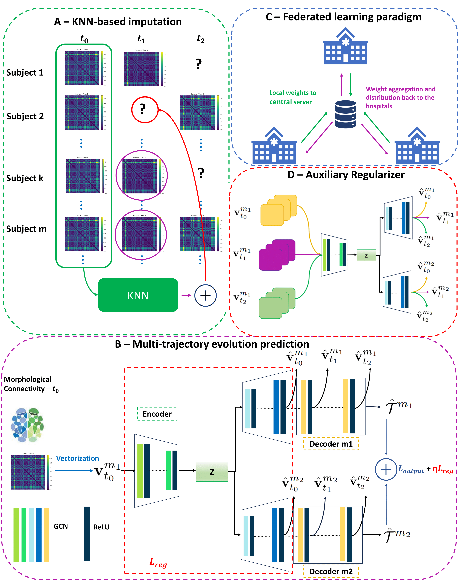

# FedGmTE-Net
FedGmTE-Net for predicting graph multi-trajectory evolution with the help of federated learning, coded up in Python by Michalis Pistos. Please contact michalis.pistos@gmail.com for inquiries. Thanks.



## Introduction
This work is accepted at the PRIME workshop in MICCAI 2023.

> **Federated Multi-trajectory GNNs Under Data Limitations for Baby Brain Connectivity Forecasting**

> [Michalis Pistos](https://github.com/mipi2610)<sup>1</sup>, [Gang Li]<sup>2</sup>, [Weili Lin]<sup>2</sup>, [Dinggang Shen]<sup>3,4,5</sup>, [Islem Rekik](https://basira-lab.com/)<sup>1</sup>
>
> <sup>1</sup>BASIRA Lab, Imperial-X and Department of Computing, Imperial College London, London, UK
> <sup>2</sup>Department of Radiology and Biomedical Research Imaging Center, University of North Carolina at Chapel Hill, Chapel Hill, NC, USA
> <sup>3</sup>School of Biomedical Engineering, ShanghaiTech University, Shanghai 201210, China
> <sup>4</sup>Shanghai United Imaging Intelligence Co., Ltd., Shanghai 200230, China
> <sup>5</sup>Shanghai Clinical Research and Trial Center, Shanghai 201210, China
>
> **Abstract:** Building accurate predictive models to forecast the trajectory evolution of baby brain networks during the first postnatal year can provide valuable
insights into the dynamics of early brain connectivity development. While emerging studies aimed to predict the evolution of brain graphs from a single observation, they suffer from two major limitations: (i) they typically rely on large training datasets to achieve satisfactory performance. However, longitudinal infant brain scans are costly and hard to acquire, and (ii) they adopt a uni-trajectory approach, lacking the ability to generalize to multi-trajectory prediction tasks, where each graph trajectory corresponds to a particular imaging modality (e.g., functional) and at a fixed resolution (graph size). To address these limitations,
we propose FedGmTE-Net*, a federated graph-based multi-trajectory evolution network. Given a small dataset, we leverage the power of federation through
collaborative model sharing among diverse hospitals. This approach not only enhances the performance of the local generative graph neural network (GNN)
model of each hospital but also ensures the preservation of data privacy. To the best of our knowledge, our framework is the first federated learning framework
designed for brain multi-trajectory evolution prediction. Further, to make the most of the limited data available at each hospital, we incorporate an auxiliary regularizer that modifies the local objective function, for more effective utilization of all the longitudinal brain connectivity in the evolution trajectory. This significantly improves the network performance. Our comprehensive experimental results demonstrate that our proposed FedGmTE-Net* outperforms benchmark methods by a substantial margin.

## Installation
### *Anaconda Installattion*
* Go to https://repo.anaconda.com/archive/
* Download version for your system (We used Python 3.10.8 on 64-bit Windows 11)
* Install the platform
* Create a conda environment by typing:  ```conda create --name fedgmte-net python=3.10.8 ```

### *Dependency Installattion*
Copy and paste the following command to install base packages:
```sh
$ conda activate fedgmte-net
$ pip install numpy
$ pip install matplotlib
$ pip install scikit-learn
$ pip install pyyaml
$ pip install torch
```

## Running FedGmTE-Net
We provide a demo code for the usage of FedGmTE-Net for predicting multi-trajectory evolution of graphs from a single baseline graph.
In main.py we train our network on a simulated dataset: 100 subjects in total with a 4-fold cross-validation. We use 25 of the subjects for testing and 75 of the subjects for training (we have 3 hospitals with 25 subjects each). Each subject has brain graphs denoting two modalities (i.e., low-resolution and super-resolution brain graphs) acquired at 3 timepoints. The first one is used as a baseline to train the model and predict the evolution trajectory including the rest of the timepoints as well. The user can modify all the program arguments and select the specific testing environment. Some of the possible user options are listed below:

* Modes (methods): NoFedGmTE-Net, FedGmTE-Net, FedGmTE-Net*
* Evaluation metrics: MAE(graph), MAE(NS)
* Data distributions: IID, non-IID (K-means split)
* Datasets: simulated dataset (100 subjects - 60% completed)

The user can also add hyper-parameters and vary their default values.

The user can run the code for training and testing with the following command:
```bash
python main.py
```

# Input and Output data
In order to use our framework, the user needs to provide a set of trajectories where a single trajectory represents a set of feature matrices acquired at multiple timepoints. A feature matrix is of size (n * d). We denote n the total number of subjects in the dataset and d the number of features extracted from the connectivity matrix. The user needs to make the appropriate changes in main.py and dataset.py to include their own data in a similar way as our simulated graphs. We note here that two feature matrices derived from two different trajecoties might have different number of features (i.e., super-resolution and low-resolution graphs). In that way, our code is generic and can be used for any type of isomorphic graph. In our example, for an input brain graph at t0 (35 x 35), our framework produces two trajectories each is a set of follow-up brain graphs  of a specific modality. The brain connectivity matrices of one modality have a size of 35 x 35 (morphological connectome) and for the second modality they have a size of 116 x 116 (functional connectome).

# Please Cite the Following paper when using our work:

@inproceedings{pistos2023federated, <br/>
  title={Federated Multi-trajectory GNNs Under Data Limitations for Baby Brain Connectivity Forecasting}, <br/>
  author={Pistos, Michalis and Li, Gang and Lin, Weili and Shen, Dinggang and Rekik, Islem}, <br/>
  booktitle={International Workshop on PRedictive Intelligence In MEdicine}, <br/>
  pages={120--133}, <br/>
  year={2023}, <br/>
  organization={Springer} <br/>
} <br/>
